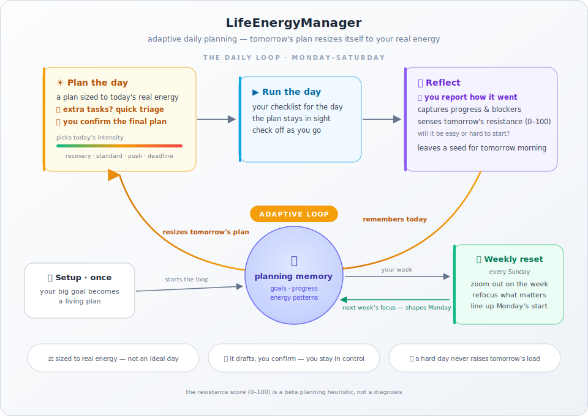

# LifeEnergyManager

[简体中文](README.zh-CN.md) | **English**

> Long-term progress is often constrained not by the size of the task list, but by the energy available to act on it.

<p align="center">
  
</p>

LifeEnergyManager is an agent-based daily planning workflow that turns big goals, current priorities, blockers, and available energy into a realistic plan for today. It ships in two parallel editions: **Codex** (scheduled tasks) and **Claude Code** (local routines).

Each day, it helps create:

- a realistic morning plan,
- a local HTML checklist/workbench,
- a desktop wallpaper reminder,
- an evening review that updates the running tracker.

Before those artifacts are created, a Goal Drift Guard closes overdue goals,
warns when safe capacity is being exhausted, and routes future-plan changes
through an explicit correction mode. Month, phase, and rebaseline changes need
three separate user replies; the final daily plan is confirmed separately.

It is meant for people whose progress depends on planning around real capacity, not an ideal version of the day.

| Question | What LifeEnergyManager does |
| --- | --- |
| What should I do today? | Turns the larger plan into a realistic daily plan. |
| What deserves my best energy? | Protects time for the work that matters most. |
| What is getting stuck? | Tracks blockers and drift before they become invisible. |
| How should tomorrow change? | Uses today's report to make the next plan easier. |

## Core philosophy

**Action first, tracking in service of action.** Track only what helps tomorrow's action.

LifeEnergyManager is not designed to create perfect plans or exhaustive self-quantification. It is designed to reduce decision fatigue, lower the cost of starting, and help important work move forward even when energy is limited.

## Platform Routing

The two editions are physically separated so an agent never mixes instructions meant for the other platform. Each platform reads only its own column:

| | Codex | Claude Code |
| --- | --- | --- |
| Entry point (auto-read) | `AGENTS.md` | `CLAUDE.md` |
| Workflow prompts | `codex/prompts/` | `claudecode/prompts/` |
| Skills | `codex/skills/` (installable `$life-energy-*`) | `.claude/skills/` (auto-discovered `life-energy-*`) |
| Subagents | subagent tools per `codex/prompts/subagents.md` | `.claude/agents/` definitions |
| Scheduling | local Codex scheduled tasks with RRULE `BYHOUR`/`BYMINUTE` | local routines in the Claude Code desktop app (system-scheduler fallback) |

Shared, platform-neutral assets: `templates/`, `examples/`, and your `outputs/` directory. The workflow logic, task names, audit blocks, and decision boundaries are identical in both editions.

Both editions ship the same nine workflow skills/roles, including
`life-energy-goal-drift-guard` and `life-energy-plan-revision`.

## Quick Start

1. Create your own `user_plan.md`.
   - Start from `templates/user_plan.md`.
   - Use `examples/graduation/` or `examples/product_launch/user_plan.md` as concrete references.
   - At minimum, include a phase plan and a current month plan. Schedule and output preferences are strongly recommended because they become the automation cadence.

2. Ask your agent to configure the workflow and automations with the matching prompt below.

### Codex

```text
Create automation from LifeEnergyManager and my user_plan.md.

Requirements:
- Read LifeEnergyManager/AGENTS.md, codex/prompts/setup.md, codex/prompts/automation.md, codex/prompts/subagents.md, and my user_plan.md. Ignore claudecode/, .claude/, and CLAUDE.md; they are the Claude Code edition.
- Initialize outputs/life_energy_tracker.md from user_plan.md.
- Put all persistent outputs under outputs/.
- Name the scheduled tasks `LifeEnergyManager - <project name> (morning planning)`, `LifeEnergyManager - <project name> (evening check-in)`, and `LifeEnergyManager - <project name> (Sunday review)`.
- Create the three scheduled tasks from codex/prompts/automation.md: morning planning, evening check-in, and Sunday review.
- For local Codex automations, encode times with RRULE `BYHOUR`/`BYMINUTE` as specified in codex/prompts/automation.md; do not use `DTSTART;TZID=...`, floating `DTSTART`, or UTC `DTSTART...Z`.
- After creating the tasks, verify that both the schedule summary and Next run show the intended local time.
- Use the matching LifeEnergyManager skill from codex/skills/ or an installed $life-energy-* skill by default. Escalate to the matching subagent only for independent review, parallel analysis, bias-prone judgment, or high-consequence planning changes as defined in codex/prompts/subagents.md. The Goal Guard and Plan Revision roles follow their narrower role-specific `only` lists. If neither is available, record main-thread fallback.
```

### Claude Code

```text
Create automation from LifeEnergyManager and my user_plan.md.

Requirements:
- Read LifeEnergyManager/CLAUDE.md, claudecode/prompts/setup.md, claudecode/prompts/automation.md, claudecode/prompts/subagents.md, and my user_plan.md. Ignore codex/ and AGENTS.md; they are the Codex edition.
- Initialize outputs/life_energy_tracker.md from user_plan.md.
- Put all persistent outputs under outputs/.
- Name the routines `LifeEnergyManager - <project name> (morning planning)`, `LifeEnergyManager - <project name> (evening check-in)`, and `LifeEnergyManager - <project name> (Sunday review)`.
- Create the three routines from claudecode/prompts/automation.md as local routines in the Claude Code desktop app (Routines -> New routine -> Local) with this workspace as the working directory and an interactive permission mode. Do not use cloud routines.
- After creating the routines, verify that both the schedule summary and the displayed next run show the intended local time.
- Use the matching life-energy-* skill from .claude/skills/ by default. Escalate to the matching subagent from .claude/agents/ only for independent review, parallel analysis, bias-prone judgment, or high-consequence planning changes as defined in claudecode/prompts/subagents.md. The Goal Guard and Plan Revision roles follow their narrower role-specific `only` lists. If neither is available, record main-thread fallback.
```

3. After setup, use the generated daily HTML workbench during the day. At night, paste the generated report into the evening check-in automation.

Automation names are always `LifeEnergyManager - <project name> (morning planning | evening check-in | Sunday review)` — the custom project name before the parentheses, the workflow type inside. The skill pipeline is the default; subagents are an escalation path for independent review, parallel analysis, bias-prone judgments, and high-consequence changes.

## Documentation

User-facing guides:

- **[中文用户指南](docs/user-guide.zh-cn.md)**: 功能、日常流程、流程图、HTML/wallpaper 模块和场景显示差异。
- **[English User Guide](docs/user-guide.en.md)**: features, daily flow, diagram, HTML/wallpaper modules, and situation-specific displays.

See **[REFERENCE.md](REFERENCE.md)** for the implementation-facing workflow contract (morning / evening / Sunday), the daily scoring model, the skill and subagent map, the workspace file layout, the template map, and the examples.

## Safety Notes

- The daily energy and drive scores are beta planning heuristics, not a diagnosis.
- Do not use this workflow as medical, psychological, legal, or financial advice.
- Do not punish an incomplete day by automatically increasing the next day's workload. Identify whether the issue was energy, overplanning, blocker, external obligation, or avoidance.

## License

Apache License 2.0. See `LICENSE` and `NOTICE`.
