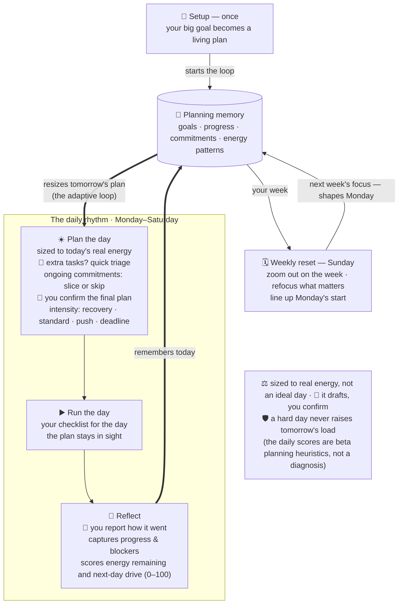

# LifeEnergyManager Reference

Deep reference for LifeEnergyManager. For the introduction and install steps, see [README.md](README.md).

## How it works

Workflow diagram source (Mermaid) — the rendered SVG is at the top of the README

Under the hood, LifeEnergyManager is a reusable prompt package for adaptive daily planning. It turns a user's phase plan, monthly plan, and rolling state into:

- a morning plan with a 3h baseline and optional 2h stretch,
- an interactive local HTML workbench for low-friction checklists and reporting,
- a static 2560x1440 desktop wallpaper plan,
- an evening check-in flow that updates rolling planning memory,
- a light Sunday review that keeps the next week aligned with the larger goal.

Version 1 is intentionally not a full web app or command-line product. It is a scheduled-automation workflow (Codex scheduled tasks, Claude Code local routines) with Markdown templates, reusable prompts, and artifact specifications.

## Recommended Files In A User Workspace

Setup creates one persistent output root: `outputs/`. It is local runtime state and is intentionally gitignored.

All persistent files created after local setup must live under `outputs/`:

- `outputs/life_energy_tracker.md`: the long-lived tracker and rolling state database.
- `outputs/daily-workbenches/YYYY-MM-DD-workbench.html`: interactive daily checklist and report generator.
- `outputs/daily-wallpapers/YYYY-MM-DD-daily-plan.png`: static desktop reminder.
- `outputs/daily-reports/YYYY-MM-DD-report.md`: optional saved report copied from the workbench.
- `outputs/phase_plan.md`, `outputs/month_plan.md`, `outputs/profile.md`: optional normalized copies.

The user may provide either one combined `user_plan.md` or separate source files (`phase_plan.md`, `month_plan.md`, `profile.md`). The setup prompt normalizes either format into `outputs/` without moving the user's original source files.

## Workflow Contract

The contract below is identical in both editions; only the invocation syntax differs (see the Platform Routing table in the README).

Morning planning:

- Read the platform's `subagents.md`, the user plan, `outputs/life_energy_tracker.md`, rolling 30-day state, active micro-sprints, and ongoing commitments.
- Determine whether the run is scheduled or a manual catch-up. Manual catch-up plans cover only the remaining window from actual run time to evening check-in.
- Ask whether there are extra tasks before finalizing the day.
- Triage extra tasks as critical, goal-leveraged, maintenance, or distraction, and judge whether each is one-day or multi-day. An accepted multi-day extra enters the tracker's Ongoing Commitments table (exit criterion, deadline date + type, placement policy) and is carried by every subsequent morning until it exits.
- Cover every active commitment in a Commitments digest inside the provisional plan: an adaptive today-slice (remaining work over remaining days, placed so it does not silently displace mainline work) or an explicit skip; conflicts with mainline work surface as explicit user decisions.
- Consider yesterday's energy remaining and actual drive (agent-calibrated variant as the primary signal) when choosing intensity.
- Use matching planning and triage skills when their triggers apply. Escalate to subagents only when the decision needs independent review, parallel analysis, or a second perspective on bias-prone tradeoffs.
- Produce a provisional plan and wait for user confirmation.
- After confirmation, generate both the HTML workbench and desktop wallpaper. Use longer readable text in the HTML and shorter readable text in the wallpaper.
- QA artifacts with the artifact QA subagent when supported because artifact QA is an independent-review task; otherwise use the artifact QA skill. Artifact QA checks both readability and layout before presentation.

Evening check-in:

- On start, immediately ask the user to paste the report generated by today's HTML workbench and wait for it; do not scan `outputs/` for an existing report.
- Update daily log, rolling state, and active micro-sprints, and settle the Ongoing Commitments table: Skip counts (evening is the only writer), progress, and criterion-based exits — a commitment closes only on exit-criterion evidence and leaves the table the same evening with a one-line Daily Log closing record.
- Score the three daily metrics with the drive-resistance skill, all 0-100 and higher = better (see the Daily Scoring Model in `templates/tracker.md`): energy remaining, predicted next-day drive, and actual drive. The agent scores blind first, then reads the user self-scores and calibrates; actual drive is a single blind value. Energy remaining and actual drive inform the next day's sizing; the predicted-vs-actual comparison is recorded for calibration only. Not a diagnosis.
- Escalate to the energy subagent when the report is ambiguous, its signals diverge, or the result would change next-day intensity.
- Generate a short seed for the next morning.

Sunday review:

- Keep it light.
- Summarize the last 7 days, compress older state, choose the next week's priorities, and identify agent-delegable work.
- Audit ongoing commitments (expired deadlines, high Skip counts, unresolved migration markers) and flag stale or exit-ready entries.
- Use the weekly review skill before finalizing next week's plan. Escalate to the weekly review subagent when repeated deferrals, unclear blockers, or major priority changes need a second pass.

## Skill Default And Subagent Escalation Strategy

LifeEnergyManager uses matching skills for bounded analysis by default. It escalates to subagents only when the platform supports them and the task benefits from independent review, parallel analysis, a second perspective on bias-prone judgment, or extra care for a high-consequence planning change. Final judgment stays with the main agent thread.

Default skill tasks: normalize phase/month plans; triage extra tasks (including one-day vs multi-day judgment and commitment-entry proposals); draft daily plan options; score the three daily metrics from evening reports; suggest status/advice/anti-distraction guidance; QA generated HTML and wallpaper artifacts; summarize weekly logs.

Skill and subagent map:

| Workflow role | Codex skill | Claude Code skill (`.claude/skills/`) | Claude Code subagent (`.claude/agents/`) |
| --- | --- | --- | --- |
| PlanNormalizerAgent | `$life-energy-plan-normalizer` | `life-energy-plan-normalizer` | `plan-normalizer` |
| UrgencyTriageAgent | `$life-energy-urgency-triage` | `life-energy-urgency-triage` | `urgency-triage` |
| DailyPlannerAgent | `$life-energy-daily-planner` | `life-energy-daily-planner` | `daily-planner` |
| EnergyQuantAgent | `$life-energy-drive-resistance` | `life-energy-drive-resistance` | `energy-quant` |
| AdviceAgent | `$life-energy-advice` | `life-energy-advice` | `advice` |
| ArtifactQAAgent | `$life-energy-artifact-qa` | `life-energy-artifact-qa` | `artifact-qa` |
| WeeklyReviewAgent | `$life-energy-weekly-review` | `life-energy-weekly-review` | `weekly-review` |

If neither matching skills nor justified subagent tools are available, the workflow continues in the main thread and records `main-thread fallback` in a `Subagent calls` audit block.

Do not fully delegate:

- final daily plan confirmation,
- major priority tradeoffs,
- accepting or rejecting urgent tasks,
- commitment dispositions (skip approvals, Skip-count/expired-deadline inquiry decisions, mainline displacement, cap evictions),
- increasing or reducing the next day's workload.

See `codex/prompts/subagents.md` or `claudecode/prompts/subagents.md` for the full contract.

## Template Map

Shared:

- `templates/user_plan.md`: user-facing intake template.
- `templates/tracker.md`: persistent state template (includes the single-source Daily Scoring Model and Ongoing Commitments rules).
- `templates/daily_workbench_template.html`: structure for the interactive daily HTML artifact.
- `templates/wallpaper_spec.md`: layout and visual rules for the desktop PNG.
- `templates/artifact_spec.md`: required HTML and wallpaper artifact behavior.
- `templates/wallpaper_generator.ps1`: optional Windows PowerShell helper for the daily wallpaper PNG. Agents should detect whether it can run; if yes, call it, and if not, generate the PNG by another suitable method while following `artifact_spec.md` and `wallpaper_spec.md`.

Codex edition:

- `AGENTS.md`: Codex entry point and routing rules.
- `codex/prompts/setup.md`: normalize a user's plan and initialize the tracker.
- `codex/prompts/automation.md`: scheduled-task setup instructions (RRULE encoding).
- `codex/prompts/morning.md`, `codex/prompts/evening.md`, `codex/prompts/sunday_review.md`: the three workflows.
- `codex/prompts/subagents.md`: skill-default and subagent-escalation contracts.
- `codex/skills/`: default bounded-analysis contracts for LifeEnergyManager tasks.

Claude Code edition:

- `CLAUDE.md`: Claude Code entry point and routing rules.
- `claudecode/prompts/setup.md`: normalize a user's plan and initialize the tracker.
- `claudecode/prompts/automation.md`: routine setup instructions (local routines in the Claude Code desktop app).
- `claudecode/prompts/morning.md`, `claudecode/prompts/evening.md`, `claudecode/prompts/sunday_review.md`: the three workflows.
- `claudecode/prompts/subagents.md`: skill-default and subagent-escalation contracts.
- `.claude/skills/`: auto-discovered `life-energy-*` skills.
- `.claude/agents/`: escalation subagent definitions.

Maintenance note: the seven skill contracts exist in both `codex/skills/` and `.claude/skills/`. When you change a skill contract, apply the same change to both copies (they differ only in escalation wording and platform paths).

## Examples

`examples/graduation/` contains an anonymized dissertation-style workflow. It keeps the same planning logic while removing personal repository names and thesis-specific identifiers.

`examples/product_launch/` contains a non-academic example to verify that the workflow does not depend on thesis-specific language.
