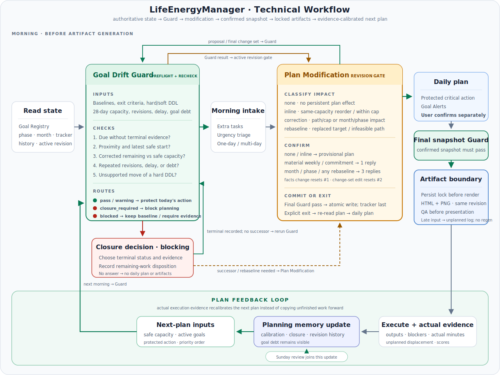

# LifeEnergyManager Reference

Deep reference for LifeEnergyManager. For the introduction and install steps,
see [README.md](README.md). For a module-by-module usage explanation, see the
[中文用户指南](docs/user-guide.zh-cn.md) or the
[English User Guide](docs/user-guide.en.md).

## How it works

```mermaid
flowchart LR
    state["Read plan and history"] --> guard["Goal Drift Guard"]
    guard --> intake["Morning intake and triage"] --> gate["Plan Revision Gate"]
    gate --> daily["Daily plan"] --> confirm["User confirmation"] --> finalGuard["Final snapshot Guard"] --> lock["Artifacts locked"]
    guard -->|due without closure| closure["Closure required"] --> terminal["Terminal label + remaining-work disposition"]
    terminal -->|no successor needed| guard
    terminal -->|successor / rebaseline needed| correction
    gate -->|persistent impact| correction["Correction mode"] --> revisionConfirm["Confirmation reply or replies"] --> recheck["Goal Guard proposal / final check"]
    recheck -->|blocked or changed| correction
    recheck -->|pass| apply["Apply one revision"] --> exitMode["Explicit mode exit"] --> daily
    lock --> execute["Execute"] --> evening["Evening report"] --> memory["History and calibration"]
    memory --> guard
    sunday["Sunday goal audit"] --> registry["Goal Registry and closure log"] --> guard
```

Logical workflow (Mermaid) — the detailed technical routing is shown below

Under the hood, LifeEnergyManager is a reusable prompt package for adaptive daily planning. It turns a user's phase plan, monthly plan, and rolling state into:

- a morning plan with a 3h baseline and optional 2h stretch,
- an interactive local HTML workbench for low-friction checklists and reporting,
- a static 2560x1440 desktop wallpaper plan,
- an evening check-in flow that updates rolling planning memory,
- a light Sunday review that keeps the next week aligned with the larger goal.

Version 1 is intentionally not a full web app or command-line product. It is a scheduled-automation workflow (Codex scheduled tasks, Claude Code local routines) with Markdown templates, reusable prompts, and artifact specifications.

## Detailed Technical Workflow

The README diagram is intentionally a user-facing Plan → Run → Reflect
overview. The diagram below shows the actual routing used by the workflow,
with the two decision-heavy modules expanded.

  

[Open the technical workflow SVG at full size](assets/technical-workflow.svg).

### Goal Drift Guard

| Interface | Technical responsibility |
| --- | --- |
| Inputs | Active Goal Registry, exit criteria, original/current dates and hard/soft type, phase/month/tracker state, recent capacity, revision history, cumulative delay, Goal debt, and the proposed/final change set when present |
| Timing | Run preflight before intake; recheck a persistent proposal and its final change set; after the user separately confirms the daily plan, run the final confirmed snapshot again immediately before artifact locking |
| Checks | Due closure, proximity/latest safe start, corrected remaining work versus safe capacity, repeated revisions/drift, and unsupported hard-deadline movement |
| Non-blocking output | `pass` or `warning`, feasibility/proximity display data, and a protected critical-path action for the provisional day |
| Blocking output | `closure_required` pauses planning until a terminal label and remaining-work disposition are recorded; a phase/month successor then follows the applicable Plan Modification/rebaseline route. `blocked` rejects the proposed transition or artifact action and preserves the baseline until evidence/renegotiation. `rebaseline_required` forces the proposal into Plan Modification rather than silently moving a date |

### Plan Modification (Revision Gate)

| Interface | Technical responsibility |
| --- | --- |
| Inputs | Guard decision, extra-task triage, current capacity and commitment cap, affected Goal IDs/levels, and the authoritative Revision ID |
| Classification | `none`, `inline`, `correction`, or `rebaseline`, based on persistent impact rather than wording alone. `correction` includes material weekly/commitment changes and ordinary month/phase impact when the target remains feasible; `rebaseline` replaces the target or handles an infeasible original path |
| Confirmation | Material weekly/commitment correction uses one dedicated reply; month/phase changes and every rebaseline use three separate replies; changed facts reset reply 1 and a changed change set resets reply 2 |
| Commit | Require the final Guard result to permit the active change set, apply one Revision ID atomically to every affected surface, write tracker last, roll back on failure, exit correction mode explicitly, and re-read the authoritative plan |
| Output | An unchanged or newly revised plan ready for separate final daily-plan confirmation |

The artifact boundary remains outside both modules. After the final daily-plan
confirmation, its final snapshot must pass Goal Drift Guard. Only then is the
lock persisted before either renderer starts. Later input is recorded as
unplanned work and displacement; it cannot reopen long-range modification or
regenerate the same day's artifacts.

Plan Modification has no direct bypass around the Guard loop: a proposal and
its final change set return to Goal Drift Guard, and the Guard result returns to
the active revision gate. Only a permitted final result can use the Daily plan
exit; `blocked` preserves the authoritative baseline and a changed result
restarts the applicable confirmation stage.

### Plan Feedback Loop

The system does not treat the confirmed day as the end of planning. After the
artifact boundary, execution and the evening report produce actual outputs,
blockers, minutes, unplanned displacement, and energy/drive signals. Planning
memory updates calibration, closure state, revision history, and Goal debt;
those values become the safe-capacity, active-goal, protected-action, and
priority inputs for the next morning Guard. Sunday review joins the same memory
update instead of maintaining a separate weekly truth source.

This feedback loop changes future plan sizing and ordering. It does not copy all
unfinished work forward, erase Goal debt, or automatically raise tomorrow's
load after a hard day.

## Recommended Files In A User Workspace

Setup creates one persistent output root: `outputs/`. It is local runtime state and is intentionally gitignored.

All persistent files created after local setup must live under `outputs/`:

- `outputs/life_energy_tracker.md`: the long-lived tracker and rolling state database.
- `outputs/daily-workbenches/YYYY-MM-DD-workbench.html`: interactive daily checklist and report generator.
- `outputs/daily-wallpapers/YYYY-MM-DD-daily-plan.png`: static desktop reminder.
- `outputs/daily-reports/YYYY-MM-DD-report.md`: optional saved report copied from the workbench.
- `outputs/artifact-locks/YYYY-MM-DD.json`: persisted same-day generation lock
  carrying the date, Revision ID, first artifact, and generation status.
- `outputs/phase_plan.md`, `outputs/month_plan.md`, `outputs/profile.md`: optional normalized copies.

The user may provide either one combined `user_plan.md` or separate source files (`phase_plan.md`, `month_plan.md`, `profile.md`). The setup prompt normalizes either format into `outputs/` without moving the user's original source files.

## Workflow Contract

The contract below is identical in both editions; only the invocation syntax differs (see the Platform Routing table in the README).

Morning planning:

- Read the platform's `subagents.md`, the user plan, `outputs/life_energy_tracker.md`, phase/month files, rolling 30-day state, Goal Baseline Registry, active micro-sprints, ongoing commitments, and revision/calibration logs.
- Run Goal Drift Guard before intake. A due goal without exit evidence becomes `closure_required`; normal planning and artifact generation stop until the user assigns a terminal label. Continuing unfinished work uses a successor Goal ID instead of moving the old goal's date.
- Determine whether the run is scheduled or a manual catch-up. Manual catch-up plans cover only the remaining window from actual run time to evening check-in.
- Ask whether there are extra tasks before finalizing the day.
- Triage extra tasks as critical, goal-leveraged, maintenance, or distraction, and judge whether each is one-day or multi-day. An accepted multi-day extra enters the tracker's Ongoing Commitments table (exit criterion, deadline date + type, placement policy) and is carried by every subsequent morning until it exits.
- Run the Plan Revision Gate before changing persistent plans. Small same-capacity weekly/commitment changes are inline. Baseline displacement, commitment-cap overflow, weekly critical-path changes, month/phase effects, and rebaseline enter correction mode before either artifact starts generating.
- Require one dedicated reply for a consequential commitment/weekly correction, or three separate replies for a month/phase change or any rebaseline. Fact changes reset confirmation to reply 1; substantive change-set edits reset it to reply 2.
- Apply one Revision ID transactionally across every affected plan file, Goal
  Registry/Closure/Revision logs, and revision counts, writing tracker `Active
  plan revision` last. The numeric suffix is a monotonic revision ordinal, not
  the number of confirmation replies. Exit correction mode explicitly, re-read
  the plan, and return to the mainline action.
- Cover every active commitment in a Commitments digest inside the provisional plan: an adaptive today-slice (remaining work over remaining days, placed so it does not silently displace mainline work) or an explicit skip; conflicts with mainline work surface as explicit user decisions.
- Consider yesterday's energy remaining and actual drive (night summary) (agent-calibrated variant as the primary signal) when choosing intensity.
- Use matching planning and triage skills when their triggers apply. Escalate to subagents only when the decision needs independent review, parallel analysis, or a second perspective on bias-prone tradeoffs.
- Produce a provisional plan with Goal Alerts and a protected critical-path action, then wait for an independent final-daily-plan confirmation.
- After confirmation, rerun Goal Drift Guard on the confirmed snapshot. Proceed
  only when it passes and no due goal remains `closure_required`; then persist
  the artifact-generation lock before either renderer starts and generate HTML
  and wallpaper from the same Revision ID.
  Once locked, long-range correction remains closed even after an interrupted
  render; later changes are unplanned work/displacement without regeneration.
- QA artifacts with the artifact QA subagent when supported because artifact QA is an independent-review task; otherwise use the artifact QA skill. Artifact QA checks both readability and layout before presentation.

Evening check-in:

- On start, immediately ask the user to paste the report generated by today's HTML workbench and wait for it; do not scan `outputs/` for an existing report.
- Update daily log, rolling state, and active micro-sprints, and settle the Ongoing Commitments table: Skip counts (evening is the only writer), progress, and criterion-based exits — a commitment closes only on exit-criterion evidence and leaves the table the same evening with a one-line Daily Log closing record.
- Update Planning Calibration with planned/actual baseline, critical-path
  minutes, planned/completed outputs, structured completed-task actual/planned
  samples, weekly output completion rate, and unplanned displacement. Explicit
  exit evidence may close a goal early; due goals without a terminal decision
  remain blocking.
- Score the three daily metrics with the drive-resistance skill, all 0-100 and higher = better (see the Daily Scoring Model in `templates/tracker.md`): energy remaining, predicted next-day drive, and actual drive (night summary). The agent scores blind first, then reads the user self-scores and calibrates; actual drive (night summary) is a single blind value. Energy remaining and actual drive (night summary) inform the next day's sizing; the predicted-vs-actual comparison is recorded for calibration only. Not a diagnosis.
- Escalate to the energy subagent when the report is ambiguous, its signals diverge, or the result would change next-day intensity.
- Generate a short seed for the next morning.

Sunday review:

- Keep it light.
- Summarize the last 7 days, compress older state, choose the next week's priorities, and identify agent-delegable work.
- Audit ongoing commitments (expired deadlines, high Skip counts, unresolved migration markers) and flag stale or exit-ready entries.
- Audit every weekly, monthly, phase, micro-sprint, and commitment goal for due closure, proximity, feasibility, revision count, cumulative delay, and goal debt.
- Use the weekly review skill before finalizing next week's plan. Escalate to the weekly review subagent when repeated deferrals, unclear blockers, or major priority changes need a second pass.

## Skill Default And Subagent Escalation Strategy

LifeEnergyManager uses matching skills for bounded analysis by default. It escalates to subagents only when the platform supports them and the task benefits from independent review, parallel analysis, a second perspective on bias-prone judgment, or extra care for a high-consequence planning change. Goal Guard and Plan Revision use their narrower role-specific `only` lists, which override the global signals. Final judgment stays with the main agent thread.

Default skill tasks: normalize phase/month plans; triage extra tasks; run the Goal Drift Guard; classify and structure plan revisions; draft daily plan options; score evening metrics; suggest status/advice/anti-distraction guidance; QA generated artifacts; and summarize weekly logs.

Skill and subagent map:

| Workflow role | Codex skill | Claude Code skill (`.claude/skills/`) | Claude Code subagent (`.claude/agents/`) |
| --- | --- | --- | --- |
| PlanNormalizerAgent | `$life-energy-plan-normalizer` | `life-energy-plan-normalizer` | `plan-normalizer` |
| UrgencyTriageAgent | `$life-energy-urgency-triage` | `life-energy-urgency-triage` | `urgency-triage` |
| GoalDriftGuardAgent | `$life-energy-goal-drift-guard` | `life-energy-goal-drift-guard` | `goal-drift-guard` |
| PlanRevisionAgent | `$life-energy-plan-revision` | `life-energy-plan-revision` | `plan-revision` |
| DailyPlannerAgent | `$life-energy-daily-planner` | `life-energy-daily-planner` | `daily-planner` |
| EnergyQuantAgent | `$life-energy-drive-resistance` | `life-energy-drive-resistance` | `energy-quant` |
| AdviceAgent | `$life-energy-advice` | `life-energy-advice` | `advice` |
| ArtifactQAAgent | `$life-energy-artifact-qa` | `life-energy-artifact-qa` | `artifact-qa` |
| WeeklyReviewAgent | `$life-energy-weekly-review` | `life-energy-weekly-review` | `weekly-review` |

If neither matching skills nor justified subagent tools are available, the workflow continues in the main thread and records `main-thread fallback` in a `Subagent calls` audit block.

Do not fully delegate:

- final daily plan confirmation,
- major priority tradeoffs,
- accepting or rejecting urgent tasks,
- commitment dispositions (skip approvals, Skip-count/expired-deadline inquiry decisions, mainline displacement, cap evictions),
- terminal labels and successor creation,
- correction-mode entry/exit, persistent revision acceptance, rebaseline, and rollback,
- increasing or reducing the next day's workload.

See `codex/prompts/subagents.md` or `claudecode/prompts/subagents.md` for the full contract.

## Template Map

Shared:

- `assets/workflow.svg`: simplified user-facing Plan → Run → Reflect overview.
- `assets/technical-workflow.svg`: implementation-facing routing diagram with
  expanded Goal Drift Guard and Plan Modification modules.
- `templates/user_plan.md`: user-facing intake template.
- `templates/tracker.md`: persistent state template (includes the single-source Daily Scoring Model and Ongoing Commitments rules).
- `templates/daily_workbench_template.html`: structure for the interactive daily HTML artifact.
- `templates/wallpaper_spec.md`: layout and visual rules for the desktop PNG.
- `templates/artifact_spec.md`: required HTML and wallpaper artifact behavior.
- `templates/wallpaper_generator.ps1`: thin Windows PowerShell entry point for the daily wallpaper PNG; reusable layout and validation live in `templates/wallpaper_renderer.psm1`. Agents should detect whether it can run; if yes, call it, and if not, generate the PNG by another suitable method while following `artifact_spec.md` and `wallpaper_spec.md`.

Codex edition:

- `AGENTS.md`: Codex entry point and routing rules.
- `codex/prompts/setup.md`: normalize a user's plan and initialize the tracker.
- `codex/prompts/automation.md`: scheduled-task setup instructions (RRULE encoding).
- `codex/prompts/morning.md`, `codex/prompts/evening.md`, `codex/prompts/sunday_review.md`: the three workflows.
- `codex/prompts/subagents.md`: skill-default and subagent-escalation contracts.
- `codex/skills/`: default bounded-analysis contracts for LifeEnergyManager tasks.

Claude Code edition:

- `CLAUDE.md`: Claude Code entry point and routing rules.
- `claudecode/prompts/setup.md`: normalize a user's plan and initialize the tracker.
- `claudecode/prompts/automation.md`: routine setup instructions (local routines in the Claude Code desktop app).
- `claudecode/prompts/morning.md`, `claudecode/prompts/evening.md`, `claudecode/prompts/sunday_review.md`: the three workflows.
- `claudecode/prompts/subagents.md`: skill-default and subagent-escalation contracts.
- `.claude/skills/`: auto-discovered `life-energy-*` skills.
- `.claude/agents/`: escalation subagent definitions.

Maintenance note: the nine skill contracts exist in both `codex/skills/` and `.claude/skills/`. When you change a skill contract, apply the same change to both copies (they differ only in escalation wording and platform paths).

## Examples

`examples/graduation/` contains an anonymized dissertation-style workflow. It keeps the same planning logic while removing personal repository names and thesis-specific identifiers.

`examples/product_launch/` contains a non-academic example to verify that the workflow does not depend on thesis-specific language.
