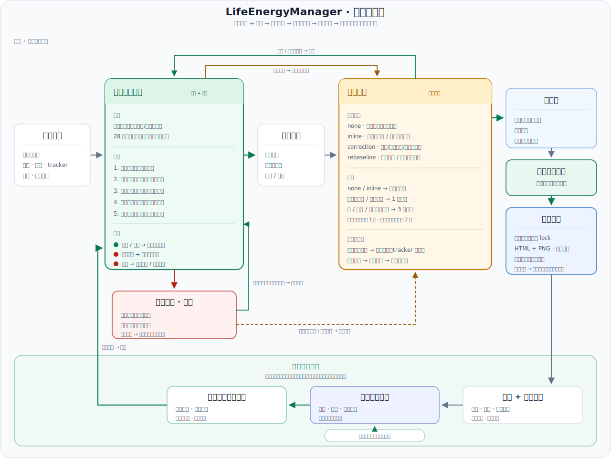

# LifeEnergyManager 参考手册

**简体中文** | [English](REFERENCE.md)

这是 LifeEnergyManager 的深入参考手册。项目介绍和安装步骤见[中文 README](README.zh-CN.md)；按模块说明的使用方法见[中文用户指南](docs/user-guide.zh-cn.md)或 [English User Guide](docs/user-guide.en.md)。

## 工作原理

```mermaid
flowchart LR
    state["读取计划和历史"] --> guard["Goal Drift Guard"]
    guard --> intake["晨间输入与分类"] --> gate["Plan Revision Gate"]
    gate --> daily["日计划"] --> confirm["用户确认"] --> finalGuard["最终快照 Guard"] --> lock["锁定产物"]
    guard -->|到期但未关闭| closure["需要关闭"] --> terminal["终态标签 + 剩余工作处置"]
    terminal -->|无需后继目标| guard
    terminal -->|需要后继目标 / rebaseline| correction
    gate -->|产生持续影响| correction["计划修正模式"] --> revisionConfirm["一次或多次确认回复"] --> recheck["Goal Guard 提案 / 最终检查"]
    recheck -->|阻塞或发生变化| correction
    recheck -->|通过| apply["应用一次修订"] --> exitMode["明确退出模式"] --> daily
    lock --> execute["执行"] --> evening["晚间报告"] --> memory["历史与校准"]
    memory --> guard
    sunday["周日目标审计"] --> registry["Goal Registry 与关闭日志"] --> guard
```

逻辑工作流（Mermaid）— 更详细的技术路由见下图

在实现层面，LifeEnergyManager 是一套可复用的自适应日计划提示词包。它把用户的阶段计划、月度计划和滚动状态转化为：

- 一份包含 3 小时 Baseline 和可选 2 小时 Stretch 的晨间计划；
- 一个用于低摩擦清单和报告的本地交互式 HTML 工作台；
- 一张静态的 2560×1440 桌面计划壁纸；
- 一套更新滚动计划记忆的晚间检查流程；
- 一次轻量周日复盘，使下周安排始终与更大目标对齐。

版本 1 有意不做成完整 Web 应用或命令行产品。它是一套由定时自动化驱动的工作流（Codex scheduled tasks、Claude Code local routines），由 Markdown 模板、可复用提示词和产物规范组成。

## 详细技术工作流

README 中的图有意只提供面向用户的“规划 → 执行 → 复盘”概览。下图展示工作流实际使用的技术路由，并展开两个需要较多判断的模块。

  

[以完整尺寸打开中文技术流程图](assets/technical-workflow.zh-CN.svg)。

### Goal Drift Guard（目标漂移守卫）

| 接口 | 技术职责 |
| --- | --- |
| 输入 | 活动 Goal Registry、退出条件、原始/当前日期及 hard/soft 类型、阶段/月度/tracker 状态、近期容量、修订历史、累计延期、Goal debt，以及存在时的提案/最终变更集 |
| 运行时机 | 在接收临时任务前执行预检；复检产生持续影响的提案及其最终变更集；用户单独确认日计划后，在锁定产物前立即再次检查最终确认快照 |
| 检查内容 | 到期关闭、接近程度/最晚安全开始日、修正后剩余工作与安全容量的关系、反复修订/漂移，以及缺乏依据的硬截止日期移动 |
| 非阻塞输出 | `pass` 或 `warning`、用于显示可行性/接近程度的数据，以及临时日计划中受保护的关键路径动作 |
| 阻塞输出 | `closure_required` 会暂停规划，直到记录终态标签和剩余工作处置；阶段/月度后继目标随后进入适用的 Plan Modification/rebaseline 路由。`blocked` 拒绝提议的状态转换或产物操作，并保留基线直至获得证据/完成重新协商。`rebaseline_required` 强制提案进入 Plan Modification，而不是静默移动日期 |

### Plan Modification（修订闸门）

| 接口 | 技术职责 |
| --- | --- |
| 输入 | Guard 决定、临时任务分类、当前容量与 commitment 上限、受影响的 Goal ID/层级，以及权威 Revision ID |
| 分类 | 根据持续影响而不是措辞本身，分类为 `none`、`inline`、`correction` 或 `rebaseline`。`correction` 包括实质性的周计划/commitment 变化，以及目标仍可行时的一般月度/阶段影响；`rebaseline` 用于替换目标或处理原路径不可行的情况 |
| 确认 | 实质性的周计划/commitment 修正使用一次专门回复；月度/阶段变更和所有 rebaseline 使用三次独立回复；事实变化会重置第 1 次回复，变更集变化会重置第 2 次回复 |
| 提交 | 要求最终 Guard 结果允许活动变更集；把同一个 Revision ID 原子写入每个受影响表面；最后写 tracker；失败时回滚；明确退出计划修正模式；重新读取权威计划 |
| 输出 | 一份未改变或已经完成修订、可供单独确认最终日计划的计划 |

产物边界位于这两个模块之外。最终日计划确认后，其最终快照必须通过 Goal Drift Guard。只有通过后，系统才会在任一渲染器启动前持久化 lock。之后收到的输入会记录为临时工作及挤占项；它不能重新打开长期计划修正，也不能重新生成当天产物。

Plan Modification 没有绕过 Guard 循环的直接路径：提案及其最终变更集会返回 Goal Drift Guard，Guard 结果再返回活动修订闸门。只有被允许的最终结果才能走 Daily plan 出口；`blocked` 会保留权威基线，发生变化的结果会重新启动适用的确认阶段。

### 计划反馈循环

系统不会把已确认的日计划视为规划的终点。越过产物边界后，执行过程和晚间报告会产生实际成果、阻塞、分钟数、临时挤占以及 energy/drive 信号。计划记忆会更新校准信息、关闭状态、修订历史和 Goal debt；这些值随后成为下一次晨间 Guard 的安全容量、活动目标、受保护动作和优先级输入。周日复盘加入同一个记忆更新过程，而不是维护另一套独立的每周事实源。

这条反馈循环会改变未来计划的容量和排序。它不会把所有未完成工作直接顺延，不会抹除 Goal debt，也不会在艰难的一天后自动提高明日负荷。

## 用户工作区中的推荐文件

设置过程会创建一个持久输出根目录：`outputs/`。它属于本地运行时状态，因此有意被 gitignore 忽略。

本地设置完成后创建的所有持久文件都必须放在 `outputs/` 下：

- `outputs/life_energy_tracker.md`：长期 tracker 和滚动状态数据库。
- `outputs/daily-workbenches/YYYY-MM-DD-workbench.html`：交互式每日清单与报告生成器。
- `outputs/daily-wallpapers/YYYY-MM-DD-daily-plan.png`：静态桌面提醒。
- `outputs/daily-reports/YYYY-MM-DD-report.md`：可选的、从工作台复制保存的报告。
- `outputs/artifact-locks/YYYY-MM-DD.json`：持久化的当日产物生成锁，包含日期、Revision ID、第一个产物和生成状态。
- `outputs/phase_plan.md`、`outputs/month_plan.md`、`outputs/profile.md`：可选的规范化副本。

用户既可以提供合并的 `user_plan.md`，也可以提供独立源文件（`phase_plan.md`、`month_plan.md`、`profile.md`）。设置提示词会把任一格式规范化到 `outputs/`，而不会移动用户的原始源文件。

## 工作流契约

以下契约在两个版本中完全相同；只有调用语法不同（见 README 中的平台分流表）。

晨间计划：

- 读取对应平台的 `subagents.md`、用户计划、`outputs/life_energy_tracker.md`、阶段/月度文件、滚动 30 日状态、Goal Baseline Registry、活动 micro-sprints、ongoing commitments，以及修订/校准日志。
- 在接收临时任务前运行 Goal Drift Guard。没有退出证据的到期目标会变成 `closure_required`；正常规划和产物生成必须停止，直到用户指定终态标签。继续未完成工作时使用后继 Goal ID，而不是移动旧目标的日期。
- 判断本次运行是定时执行还是 manual catch-up。Manual catch-up 只规划从实际运行时刻到晚间检查之间的剩余窗口。
- 在最终确定日计划前，询问是否存在临时任务。
- 把临时任务分类为 critical、goal-leveraged、maintenance 或 distraction，并判断每项是单日还是多日任务。被接受的多日临时任务会进入 tracker 的 Ongoing Commitments 表（退出条件、截止日期及类型、放置策略），此后每个晨间流程都会继续携带，直到它退出。
- 在修改持久计划前运行 Plan Revision Gate。同容量内的小型周计划/commitment 变化属于 inline。Baseline 挤占、commitment 上限溢出、周关键路径变化、月度/阶段影响和 rebaseline 必须在任一产物开始生成前进入计划修正模式。
- 影响较大的 commitment/周计划修正需要一次专门回复；月度/阶段变化或任意 rebaseline 需要三次独立回复。事实变化会把确认重置到第 1 次；变更集的实质编辑会重置到第 2 次。
- 使用同一个 Revision ID，以事务方式更新所有受影响的计划文件、Goal Registry/Closure/Revision 日志和修订计数，最后写入 tracker 的 `Active plan revision`。数字后缀是单调递增的修订序号，不是确认回复次数。明确退出计划修正模式，重新读取计划，然后回到主线动作。
- 在临时日计划的 Commitments digest 中覆盖每个活动 commitment：为其安排自适应的 today-slice（剩余工作除以剩余天数，并以不静默挤占主线工作的方式放置），或者明确 skip；与主线工作的冲突必须作为明确的用户决定呈现。
- 选择强度时，考虑昨日 energy remaining 和 actual drive (night summary)，并以 agent-calibrated 变体作为主要信号。
- 在触发条件满足时使用相应的 planning 和 triage skills。只有判断需要独立复核、并行分析，或需要第二视角审查容易产生偏差的取舍时，才升级到 subagents。
- 生成包含 Goal Alerts 和受保护关键路径动作的临时计划，然后等待一次独立的最终日计划确认。
- 确认后，在已确认快照上重新运行 Goal Drift Guard。只有在它通过且没有到期目标仍处于 `closure_required` 时才继续；随后在任一渲染器启动前持久化产物生成 lock，并用同一个 Revision ID 生成 HTML 和壁纸。lock 一旦写入，即使渲染中断，长期计划修正也保持关闭；之后的变化只记录为临时工作/挤占，不重新生成产物。
- 平台支持时，使用 artifact QA subagent 检查产物，因为产物 QA 属于独立复核任务；否则使用 artifact QA skill。Artifact QA 必须在展示前同时检查可读性和布局。

晚间检查：

- 启动后立即要求用户粘贴当天 HTML 工作台生成的报告并等待；不要扫描 `outputs/` 寻找已有报告。
- 更新每日日志、滚动状态和活动 micro-sprints，并结算 Ongoing Commitments 表：Skip 计数（晚间流程是唯一写入者）、进度和基于退出条件的退出。Commitment 只有在存在退出条件证据时才关闭，并在当晚从表中移除，同时在 Daily Log 留下一行关闭记录。
- 更新 Planning Calibration，包括 planned/actual baseline、关键路径分钟数、计划/完成成果、结构化的已完成任务 actual/planned 样本、每周成果完成率和临时挤占。明确的退出证据可以提前关闭目标；没有终态决定的到期目标仍然保持阻塞。
- 使用 drive-resistance skill 计算三项日指标；全部为 0–100 且越高越好（见 `templates/tracker.md` 中的 Daily Scoring Model）：energy remaining、predicted next-day drive 和 actual drive (night summary)。Agent 先盲评，再读取用户自评分并完成校准；actual drive (night summary) 只有一个 blind 值。Energy remaining 和 actual drive (night summary) 用于确定次日容量；predicted 与 actual 的对比只用于校准记录。它们不是诊断。
- 当报告含义不清、信号彼此冲突，或结果会改变次日强度时，升级到 energy subagent。
- 为次日晨间生成一条简短 seed。

周日复盘：

- 保持轻量。
- 汇总最近 7 天，压缩更早状态，选择下周优先级，并识别可交给 agent 的工作。
- 审计 ongoing commitments（过期截止日期、较高 Skip 计数、未解决的迁移标记），并标记已经陈旧或可以退出的条目。
- 审计每个周、月、阶段、micro-sprint 和 commitment 目标的到期关闭、接近程度、可行性、修订次数、累计延期和 Goal debt。
- 在最终确定下周计划前使用 weekly review skill。当反复推迟、阻塞不清或重大优先级变化需要第二轮检查时，升级到 weekly review subagent。

## Skill 默认路径与 Subagent 升级策略

LifeEnergyManager 默认使用相应 skill 进行边界明确的分析。只有平台支持 subagent，且任务需要独立复核、并行分析、对容易产生偏差的判断提供第二视角，或对影响重大的计划变化格外谨慎时，才升级到 subagent。Goal Guard 和 Plan Revision 使用各自更窄的角色专用 `only` 列表，它们优先于全局信号。最终判断仍由主 agent 线程完成。

默认 skill 任务包括：规范化阶段/月度计划；分类临时任务；运行 Goal Drift Guard；对计划修订进行分类和结构化；起草日计划选项；计算晚间指标；提出状态/建议/抗分心指导；检查生成的产物；汇总每周日志。

Skill 与 subagent 对应表：

| 工作流角色 | Codex skill | Claude Code skill（`.claude/skills/`） | Claude Code subagent（`.claude/agents/`） |
| --- | --- | --- | --- |
| PlanNormalizerAgent | `$life-energy-plan-normalizer` | `life-energy-plan-normalizer` | `plan-normalizer` |
| UrgencyTriageAgent | `$life-energy-urgency-triage` | `life-energy-urgency-triage` | `urgency-triage` |
| GoalDriftGuardAgent | `$life-energy-goal-drift-guard` | `life-energy-goal-drift-guard` | `goal-drift-guard` |
| PlanRevisionAgent | `$life-energy-plan-revision` | `life-energy-plan-revision` | `plan-revision` |
| DailyPlannerAgent | `$life-energy-daily-planner` | `life-energy-daily-planner` | `daily-planner` |
| EnergyQuantAgent | `$life-energy-drive-resistance` | `life-energy-drive-resistance` | `energy-quant` |
| AdviceAgent | `$life-energy-advice` | `life-energy-advice` | `advice` |
| ArtifactQAAgent | `$life-energy-artifact-qa` | `life-energy-artifact-qa` | `artifact-qa` |
| WeeklyReviewAgent | `$life-energy-weekly-review` | `life-energy-weekly-review` | `weekly-review` |

如果相应 skills 和有充分理由调用的 subagent 工具都不可用，工作流会在主线程中继续，并在 `Subagent calls` 审计区块中记录 `main-thread fallback`。

以下事项不能完全委托：

- 最终日计划确认；
- 重大优先级取舍；
- 接受或拒绝紧急任务；
- commitment 处置（skip 批准、Skip-count/过期截止日期询问决定、主线挤占、超出上限后的移除）；
- 终态标签和后继目标创建；
- 进入/退出计划修正模式、接受持久修订、rebaseline 和回滚；
- 增加或减少次日工作量。

完整契约见 `codex/prompts/subagents.md` 或 `claudecode/prompts/subagents.md`。

## 模板对应表

共享资源：

- `assets/workflow.svg`：面向用户的简化版“规划 → 执行 → 复盘”概览。
- `assets/workflow.zh-CN.svg`：上述用户流程图的中文版本。
- `assets/technical-workflow.svg`：面向实现的技术路由图，展开 Goal Drift Guard 和 Plan Modification 模块。
- `assets/technical-workflow.zh-CN.svg`：上述技术流程图的中文版本。
- `templates/user_plan.md`：面向用户的输入模板。
- `templates/tracker.md`：持久状态模板（包括单一事实源 Daily Scoring Model 和 Ongoing Commitments 规则）。
- `templates/daily_workbench_template.html`：交互式每日 HTML 产物的结构。
- `templates/wallpaper_spec.md`：桌面 PNG 的布局与视觉规则。
- `templates/artifact_spec.md`：HTML 与壁纸产物必须满足的行为要求。
- `templates/wallpaper_generator.ps1`：每日壁纸 PNG 的轻量 Windows PowerShell 入口；可复用的布局和验证逻辑位于 `templates/wallpaper_renderer.psm1`。Agent 应先检测它能否运行；可运行时调用它，否则使用其他合适方法生成 PNG，同时遵守 `artifact_spec.md` 和 `wallpaper_spec.md`。

Codex 版本：

- `AGENTS.md`：Codex 入口与路由规则。
- `codex/prompts/setup.md`：规范化用户计划并初始化 tracker。
- `codex/prompts/automation.md`：定时任务设置说明（RRULE 编码）。
- `codex/prompts/morning.md`、`codex/prompts/evening.md`、`codex/prompts/sunday_review.md`：三个工作流。
- `codex/prompts/subagents.md`：skill 默认路径与 subagent 升级契约。
- `codex/skills/`：LifeEnergyManager 任务默认使用的边界明确的分析契约。

Claude Code 版本：

- `CLAUDE.md`：Claude Code 入口与路由规则。
- `claudecode/prompts/setup.md`：规范化用户计划并初始化 tracker。
- `claudecode/prompts/automation.md`：routine 设置说明（Claude Code 桌面应用中的本地 routines）。
- `claudecode/prompts/morning.md`、`claudecode/prompts/evening.md`、`claudecode/prompts/sunday_review.md`：三个工作流。
- `claudecode/prompts/subagents.md`：skill 默认路径与 subagent 升级契约。
- `.claude/skills/`：自动发现的 `life-energy-*` skills。
- `.claude/agents/`：升级时使用的 subagent 定义。

维护说明：九个 skill 契约同时存在于 `codex/skills/` 和 `.claude/skills/`。修改某个 skill 契约时，应把同样的变化应用到两个副本（它们只在升级措辞和平台路径上不同）。

## 示例

`examples/graduation/` 包含一套匿名化的论文式工作流。它保留相同的规划逻辑，同时移除了个人仓库名和论文专用标识。

`examples/product_launch/` 包含一个非学术示例，用于验证工作流不依赖论文场景的专用语言。
