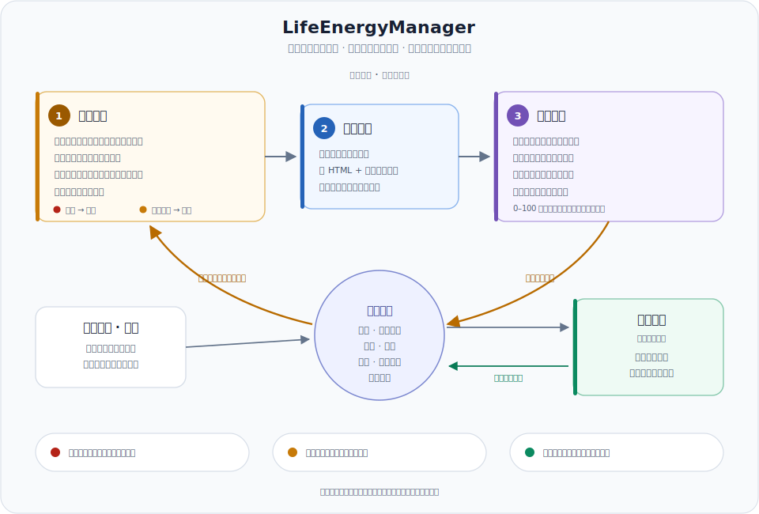

# LifeEnergyManager 用户指南

[English guide](user-guide.en.md) · [返回中文 README](../README.zh-CN.md)

LifeEnergyManager 是一个围绕真实精力和长期目标工作的日计划管理器。它不只是把任务排进今天，还会检查目标是否正在漂移、到期目标是否已经结束、临时变化是否会破坏后续周/月/阶段计划，并把当天确认后的计划生成成 HTML 工作台和桌面 wallpaper。

这份指南面向实际使用者，依次解释：管理器能做什么、一天如何流转、流程图怎么读、HTML 和 wallpaper 中每个模块代表什么，以及不同场景下界面为什么会变化。

## 1. 它解决什么问题

LifeEnergyManager 把五件容易彼此冲突的事放进同一条工作流：

1. 从阶段、月、周、micro-sprint 和 ongoing commitment 中找出今天真正重要的动作。
2. 根据近期实际专注时间，而不是理想工时，控制当天容量。
3. 在长期计划被临时任务影响时，明确区分小调整、计划修正和目标重基线。
4. 强制每个到期目标获得一个结束标签，避免目标通过不断改日期而永久保持 active。
5. 用晚间报告积累估算、实际投入、阻塞和临时工作记录，让下一次计划更准确。

它每天通常生成：

- 一份经用户确认的 Baseline / Stretch 日计划；
- 一个可离线使用、自动保存输入的 HTML 工作台；
- 一张 2560×1440 的静态桌面 wallpaper；
- 一份可复制或下载的 Markdown 晚间报告。

## 2. 开始前需要理解的概念

### 2.1 计划层级和 Goal ID

| 层级 | Goal ID 示例 | 含义 |
| --- | --- | --- |
| Phase | `PH-DISSERTATION` | 一个阶段性成果或里程碑 |
| Month | `MO-2026-07` | 当月需要关闭的成果窗口 |
| Week | `WK-2026-07-13` | 一周内需要交付或关闭的结果 |
| Micro-sprint | `MS-ANALYSIS` | 跨数日、范围较小的连续工作 |
| Commitment | `CM-REVIEW` | 已接受并需要持续跟踪的额外承诺 |

每个可结束目标都需要日期、日期类型（hard 或 soft）、退出条件和状态。Goal ID 用于把 tracker、计划文件、HTML、wallpaper 和晚间报告中的同一目标对应起来。

### 2.2 Baseline、Stretch 和关键路径

- **Baseline**：在正常情况下应优先完成的核心工作，默认目标约为 3 小时，但会按历史容量和当天可用窗口调整。
- **Stretch**：Baseline 完成且精力仍允许时才做的工作，默认上限约为 2 小时。
- **Critical path**：直接影响迫近目标、关键交付或退出条件的动作。存在目标预警时，日计划必须保护至少一个关键路径动作。
- **Ongoing commitment slice**：某个多日承诺今天应该完成的切片。完成切片不等于关闭整个 commitment；晚间仍需根据退出条件判断是否结束。

### 2.3 风险和可行性

| 字段 | 代表什么 | 如何解读 |
| --- | --- | --- |
| Proximity | 距离目标安全开始或到期状态 | `normal`、`approaching`、`critical`、`due` |
| Feasibility | 现有容量能否覆盖修正后的剩余工作 | `green`、`yellow`、`red`、`unknown` |
| Corrected remaining | 经历史估算系数修正后的剩余分钟 | 比原始估算更接近真实工作量 |
| Safe capacity | 可安全承诺的容量 | 历史 expected capacity × 0.8 |
| Coverage | 截止日前安全容量 ÷ 修正后剩余工作量 | `≥1.25` green；`1.05–1.24` yellow；`<1.05` red |
| Latest safe start | 不消耗最后缓冲的最晚开始日 | 到达该日期通常进入 critical |
| Goal debt | 因修订被移出原计划窗口、但仍需完成的分钟 | 修改 DDL 不会把它清零 |

容量默认使用最近 28 个可比较工作日，最近 7 天权重更高。少于 7 个可比较日期时使用 minimum focused-time target，并显示 low confidence。Recovery、catch-up、疾病和旅行会保留标签，但不会直接和普通工作日混算。

### 2.4 Revision ID

`PR-YYYYMMDD-N` 是一次权威计划修订的编号。受影响的 tracker、阶段/月计划、HTML 和 PNG 必须引用同一个 Revision ID。数字后缀是当天单调递增的修订序号，不是确认次数。

## 3. 一天的完整流程

### 3.1 Morning planning

1. 读取 tracker、阶段/月计划、活动目标、commitments、历史容量和当前 Revision ID。
2. Goal Drift Guard 检查目标到期、接近程度、可行性、累计延期和 Goal debt。
3. 如果存在到期未结束目标，先进入 `closure_required`；在选择终态前不继续日计划，也不生成新产物。
4. 询问今天新增的 extra tasks，并判断紧急性、一日/多日属性及对主线的影响。
5. Plan Revision Gate 把变化分类为 `none`、`inline`、`correction` 或 `rebaseline`。
6. 必要时进入计划修正模式，完成专门确认、原子写入并明确退出。
7. 重新读取最新计划，生成 provisional daily plan 和 Goal Alerts。
8. 用户单独确认最终日计划。
9. 在任一渲染器开始前写入 artifact lock。
10. 使用同一 Revision ID 生成 HTML 和 wallpaper，并完成视觉和语义 QA。

### 3.2 Plan Revision Gate 如何分类

| 类型 | 常见情况 | 是否进入修正模式 | 确认 |
| --- | --- | --- | --- |
| `none` | 输入不影响计划 | 否 | 无额外确认 |
| `inline` | 下周小换序、同容量替换、预算内 commitment 调整 | 否 | 随 provisional plan 一次确认 |
| `correction` | 挤占 Baseline、commitment 超上限、关键路径或周容量发生实质变化 | 是 | 一次专门确认 |
| `rebaseline` | 月/阶段变化、原目标已不可行、累计漂移或反复修订 | 是 | 三个独立用户回复 |

月、阶段或任何 rebaseline 的三次回复依次确认事实、修改差异、可行性与后果。事实变化会重置到第 1 次；change set 实质变化会重置到第 2 次。用户可输入 `退出计划修正` 放弃未提交提案；退出是终态，退出后的确认不会继续累计。

### 3.3 Artifact lock 以后

HTML 或 PNG 任一个开始生成后，当天长期计划修正入口关闭：

- 不再改周/月/阶段计划；
- 不重新生成当天 HTML 或 PNG；
- 新出现的工作记录到 `Unplanned work`、`Unplanned minutes` 和 `What it displaced`；
- 晚间入库，下一次 morning 再判断是否需要修订。

### 3.4 Evening check-in

用户从 HTML 复制或下载 Generated report，并把报告交给 evening check-in。系统会更新完成情况、阻塞、实际分钟、commitment 状态、Planning Calibration、三项状态分数和次日第一动作。明确证据可以提前关闭目标。

### 3.5 Sunday review

Sunday review 汇总最近 7 天，审计所有周/月/阶段/micro-sprint/commitment 的到期关闭、风险、累计延期和 Goal debt，并为下一周确定优先级。它不是把未完成任务机械搬到下周。

## 4. 如何阅读流程图



图刻意把详细判断收进少数几个用户可感知的模块：

| 区域 | 模块 | 里面包含什么 |
| --- | --- | --- |
| Daily loop | Plan the day | Goal Guard、容量判断、extra-task triage、必要的计划修正和最终日计划确认 |
| Daily loop | Run the plan | 经确认的 checklist、HTML/wallpaper，以及从产物开始时生效的 Revision lock |
| Daily loop | Reflect | 晚间成果、阻塞、实际分钟、临时挤占、energy/drive 信号和明日第一动作 |
| Adaptive loop | Planning memory | Goal Registry、关闭记录、历史容量、漂移、Revision 和 Goal debt |
| Side entries | Setup · once / Sunday review | 第一次建立 living plan；每周关闭到期目标并重新聚焦下一周 |

两条弧线是图的核心：Reflect 把真实结果写入 Planning memory，Planning memory 再按历史容量调整下一天。图中不再展开 `closure_required` 和修正模式的每个步骤，只用红色 `due → close` 与琥珀色 `material impact → revise` 提醒这两类 Guard；详细的终态和 1 次/3 次确认规则见本指南第 3、8 节。

Run 模块里的 `Artifact start locks revisions` 是硬边界：修正只能发生在 HTML/PNG 开始生成之前。底部三条原则说明所有到期目标都要结束、实质修改仍由用户确认，而且系统不会因为一次低能量日惩罚性增加下一天工作量。

需要查看 Goal Drift Guard 和 Plan Modification 的实际判断、阻塞、确认和提交路由时，请打开[中文技术流程图](../assets/technical-workflow.zh-CN.svg)；对应的实现契约见[中文参考手册](../REFERENCE.zh-CN.md#详细技术工作流)。

## 5. Wallpaper 中的模块

Wallpaper 是静态提醒，不承担编辑、确认或详细解释功能。页面从上到下是：

```text
Title / subtitle                         Task focus | Time mix
Task-category legend
[Goal Alert Strip：有风险时才出现]
Progress row
Baseline tasks | Stretch tasks | Status and advice
Revision ID footer
```

| 模块 | 显示内容 | 用途 |
| --- | --- | --- |
| Title / subtitle | 日期、阶段/日类型、manual catch-up 时间窗 | 确认正在看哪一天的计划 |
| Task focus | 今天主要工作类型 | 使用任务分类色，不使用风险色 |
| Time mix | Baseline 与 Stretch 推荐组合 | 快速判断今天承诺了多少时间 |
| Task legend | 橙/蓝/绿/灰四类任务语义 | 所有项目保持同一颜色含义 |
| Goal Alert Strip | 最高风险目标、DDL、剩余工作、今天必须动作 | 只在 approaching/critical/due 时出现 |
| Progress row | 最多 5 个 week/sprint/commitment/month/phase 进度 | Month 倒数第二，Phase 最后 |
| Baseline | 必须优先保护的任务 | 左列 |
| Stretch | 有余力再做的任务 | 中列；可缩减或显示 No stretch |
| Status and advice | Status summary、Today advice、Anti-distraction tip | 右列固定三块，不重复完整预警 |
| Revision footer | 当前 Revision ID | 用于确认 wallpaper 与 HTML/tracker 同版本 |

### Wallpaper 的场景差异

| 场景 | 显示变化 |
| --- | --- |
| 无风险 | Goal Alert Strip 完全消失，布局回收其高度 |
| Approaching | 浅琥珀背景和文字标签 `APPROACHING` |
| Critical 或 Due | 浅红背景、深红强调线和明确文字标签 |
| 多个预警 | 只显示最高风险目标，并写 `另有 N 项预警`；详细项留在 HTML |
| Manual catch-up | Subtitle 显示实际开始到 evening check-in 的剩余窗口；不显示已经错过的时间块 |
| 当天无 Stretch | 中列缩减或显示 `No stretch`，不虚构任务填满版面 |
| 文本太长 | 优先删除次要说明或减少任务，不使用 ellipsis 或难懂缩写 |

## 6. HTML Workbench 中的模块

HTML 是当天的交互工作区。输入保存在浏览器 `localStorage`，刷新后仍可恢复；它不需要联网。

| 模块 | 代表什么 | 何时变化 |
| --- | --- | --- |
| Header summary | 日期、Task focus 和 Time mix | 随当天任务类型和容量变化 |
| Goal Guard Overview | 所有 approaching/critical/due 目标；无预警时显示绿色 pass | 按 `due → critical → approaching` 排序 |
| Feasibility cards | Corrected remaining、Safe capacity、Coverage/confidence | 随历史和剩余工作变化 |
| Why this warning | 历史窗口、可比较天数、day labels、estimate factor、latest safe start 和原因 | 默认折叠，按需展开 |
| Plan Revision Snapshot | Revision ID、影响层级、修改前后、累计延期、Goal debt、状态 | 当天发生修订时自动展开；否则折叠或在无数据时隐藏 |
| Plan Stack | Phase、Month、Week、Sprint、Commitment 进度卡 | HTML 不受 wallpaper 的五条上限限制 |
| Task-category legend | 橙、蓝、绿、灰的任务语义 | 不随项目改变 |
| Ongoing commitments | 每个 commitment 今天的切片 | 勾选 Done 只完成切片，不自动关闭承诺 |
| Today suggestion | 当天建议，以及用户的 Energy remaining / Predicted next-day drive 自评 | 自评进入晚间报告，次日才进入历史图 |
| Recent state | 7 天 focus 柱图、energy/drive 折线、建议和 calibration 摘要 | 无历史时显示 `Waiting For Recording` |
| Baseline / Stretch | 当天任务卡和执行记录 | 每卡可填 Done、Status、Actual min、Note/output、Blocker/next action |
| Global fields | 全局阻塞、明日第一动作、身体/精力状态、Agent work、临时工作及挤占项 | 用于晚间归因，不是长期计划编辑入口 |
| Generated report | 汇总任务、Goal Alert、Revision ID、关键路径、估算/实际和临时挤占 | 随输入自动更新，可复制或下载 `.md` |

### Recent state 图怎么读

- 灰色柱：每日 focus minutes，使用左轴。
- 绿色实线：energy remaining，使用右侧 0–100 轴。
- 蓝色虚线：predicted next-day drive，使用右轴。
- 橙色实线：actual drive (night summary)，使用右轴。
- Perspective 下拉框会同时切换 Energy remaining 和 Predicted drive 的 Self / Agent blind / Agent calibrated 视角；Actual drive 始终是单一 agent 值。
- 今天的数据不会立即进入图表，而是在晚间报告处理后于下一天出现。

## 7. 不同场景下会看到什么

| 场景 | 对话/工作流 | HTML | Wallpaper |
| --- | --- | --- | --- |
| 普通、无风险日 | 正常确认日计划 | 绿色 `Goal Guard passed` | 不显示 Alert Strip |
| 目标 approaching | 保护一个关键路径动作 | 琥珀预警和可行性详情 | 琥珀 Alert Strip |
| 目标 critical/due | 强调今天必须动作；可能要求关闭 | 深红 banner，所有预警排序展示 | 只显示最高风险深红预警 |
| Due 且无终态 | `closure_required`，等待用户决定 | 不生成新的当天 HTML | 不生成新的当天 PNG |
| 下周小换序 | Inline，随 provisional plan 一次确认 | Snapshot 通常折叠 | Footer 使用新 Revision ID（如已产生修订） |
| 月/阶段/rebaseline | 进入修正模式，三次独立回复，退出后回主线 | Snapshot 自动展开，显示 before/after 和 debt | 只显示结果与 Revision ID，不显示确认过程 |
| 用户退出修正 | 丢弃提案，回到最后确认版本 | 使用原权威 revision 生成 | 使用原权威 revision 生成 |
| 产物后新增任务 | 不再修订或重生成 | 填入 Unplanned work/minutes/displaced | 当天 wallpaper 不改变 |
| 历史少于 7 个可比较日 | 使用配置 fallback | Confidence 显示 low | 只显示结论，不显示公式 |
| 历史达到 7 日 | 使用加权中位数容量 | Confidence 可显示 high，详情可展开 | 仍只保留简短风险文案 |
| 多个目标预警 | Daily Planner 选择最高优先动作 | 展示全部预警 | 最高预警 + 其余数量 |
| Manual catch-up | 只计划剩余时间 | 标明 catch-up window | 调整 Baseline/Stretch 和 subtitle |

## 8. 目标必须如何结束

所有到期目标最终必须选择以下标签之一：

| 终态 | 使用条件 | 额外要求 |
| --- | --- | --- |
| `completed` | 退出条件已经满足 | 必须记录证据 |
| `partially_completed` | 完成了一部分，但目标窗口结束 | 必须处置剩余工作；继续时创建 successor |
| `missed` | 未达到退出条件且窗口已结束 | 记录原因和剩余工作处置 |
| `superseded` | 被新的目标正式替代 | 必须指向新的 successor Goal ID |
| `dropped` | 明确决定不再继续 | 记录原因，不能静默消失 |

继续未完成工作时，旧目标仍然结束，新目标获得新的 Goal ID、日期和退出条件。不能直接覆盖旧目标日期来逃避结束判断。

## 9. 四个常见例子

### 例 1：只把下周两个任务换顺序

如果不改变总容量、关键路径和更高层计划，通常归类为 inline。它不会进入修正模式，而是和 provisional daily plan 一起确认。

### 例 2：把阶段 DDL 推迟一周

系统会核对 DDL 是 hard 还是 soft、历史容量和 Goal debt。阶段变更属于 rebaseline，需要三次独立回复。外部 hard deadline 没有新证据时不能移动，只能标记需要重新协商。

### 例 3：目标今天到期，但只完成了一半

Morning 会进入 `closure_required`。用户可选择 `partially_completed`，记录已有成果和剩余工作，并创建 successor；旧目标不会继续保持 active。

### 例 4：HTML 和 wallpaper 生成后临时来了 45 分钟任务

当天不再修改长期计划，也不重新生成产物。用户在 HTML 的 Unplanned work 中记录任务、分钟和它挤占的原计划，晚间再归因，次日 Guard 决定是否需要计划修正。

## 10. 文件和数据放在哪里

运行时持久文件统一放在用户工作区的 `outputs/`：

- `outputs/life_energy_tracker.md`：Goal Registry、关闭记录、历史和当前计划；
- `outputs/phase_plan.md`、`outputs/month_plan.md`：规范化长期计划；
- `outputs/daily-workbenches/`：每日 HTML；
- `outputs/daily-wallpapers/`：每日 PNG；
- `outputs/daily-reports/`：可选的 Markdown 报告；
- `outputs/artifact-locks/`：当天产物锁。

原始 `user_plan.md` 保持只读。tracker 是运行时单一事实源；当文件含义冲突时，不能静默选择其中一个版本。

## 11. 使用边界

- 能量和 drive 分数是计划启发式，不是医学或心理诊断。
- 未完成一天不会自动导致次日加量；系统应先判断是过度规划、能量、阻塞、外部义务还是回避。
- Wallpaper 是静态提醒，不显示实时进度、长流程说明、晚间表单或详细 Guard 公式。
- HTML 是当日记录工具，不是 artifact lock 后重新编辑长期计划的入口。
- 最终产物只有在 Guard 通过、到期目标有终态、修正模式已退出、日计划已确认、Revision ID 一致且视觉 QA 通过时才能呈现。

需要安装与平台配置时，请阅读[中文 README](../README.zh-CN.md)；需要精确的 prompts、skills 和文件契约时，请阅读[中文参考手册](../REFERENCE.zh-CN.md)。
